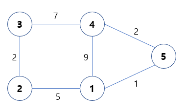

## 플로이드 워셜 알고리즘

### 관련문제

**[백준 1058 - 친구](https://github.com/augusstt06/Baekjoon/blob/main/%EB%B0%B1%EC%A4%80/Silver/1058.%E2%80%85%EC%B9%9C%EA%B5%AC/%EC%B9%9C%EA%B5%AC.py)**

모든 지점에서 다른 모든 지점까지의 최단 경로를 모두 구해야 하는 경우에 사용하는 알고리즘이다.

> 그래프에서 모든 정점 사이의 최단거리

> 시간 복잡도 : O(N^3)

- 모든 노드별로 특정 노드를 거쳐 다른 모든 노드로 가는 최단 경로는 저장해야 하므로 2차원 리스트를 활용한다.

- 노드와 간선의 갯수가 많다면 `다익스트라 최단경로 알고리즘`이 효과적

> 점화식 : D_a = min(D_ab, D_ak + D_bk)

- D_ab : 노드 A에서 노드 B로 가는 최단거리

즉 위의 점화식은 `A -> B의 거리`를 `A -> B의 거리와 A -> K -> B의 거리를 비교`하여 작은값을 리턴한다.

### 동작 과정

- 인접행렬로 그래프 표시
  - 초기에 연결되지 않은 노드와 관계는 INF로 표시
- 인접행렬을 이용하여 특정 노드를 경유하는 거리값이 기존거리보다 작다면 갱신.

- 모든 노드를 경유한 경우를 고려해야 하기 때문에, 모든 노드에 대해 2번 반복
